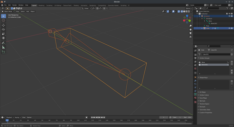
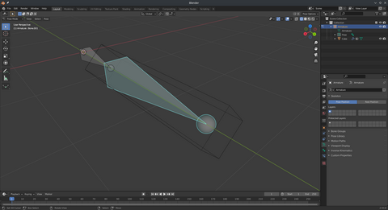
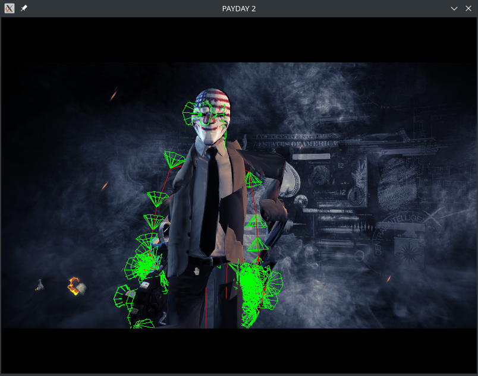

# Rigging and Animations

Or: how to make and modify custom player and cop models.

As of the version of the model tool that contains this documentation, the rigging
support is basically finished, and is almost seamless to use.

The TL;DR is that:

```xml
<?xml version="1.0" ?>
<modelscript>
    <load file="input.model"/>
    <export file="original.glb"/>
    <!-- Import original.glb to Blender, modify it, export as modified.glb -->
    <import file="modified.glb" createnewobjects="true">
        <option name="import-transforms">false</option>
    </import>
    <save file="output.model"/>
</modelscript>
```

Is all you need to get a model exported properly.

## Animations and bone transforms

When rigging a model, each bone actually has two transforms (a transform is
the combination of translation, rotation and scaling). One transform gives
the bone's position relative to it's parent, and the other transform (this
is the 'object transform') and the other one is the bind transform - it's
used to determine how the bone attaches to the skin. You don't set the bind
transform yourself when modelling, Blender figures it out for you.

Here's an example: In blender, create a small box and attach it to a bone:


In the armature's edit mode, we can roll (using the 'N' panel) the bone, and the
mesh stays exactly the same:



At this point, we've changed the bone's object transform (by rotating it), but
the mesh it's attached to hasn't also rotated. This is because Blender internally
rotated the bind transform backwards 45° to compensate, so the skin stays in
the same place.

Now, let's pretend we're PAYDAY and we're loading an animation made for the original
model. The animation says the bone shouldn't have any rotation. We can simulate this by
going into pose mode, and setting the bone to have no rotation:



The bone is now in the same position and orientation as it was in the first screenshot,
but the model it's attached to is now rotated 45°.

This is what would happen if we used the following script, modified from above:

```xml
<?xml version="1.0" ?>
<modelscript>
    <load file="input.model"/>
    <export file="original.glb"/>
    <import file="modified.glb" createnewobjects="true">
        <!-- Note we haven't included the import-transforms flag here -->
    </import>
    <save file="output.model"/>
</modelscript>
```

Unfortunately, when you import a GLTF model into blender, all the bones get
rotated like in the 2nd screenshot.

By default, when you import a GLTF/GLB file into the model tool, all the objects
in the model (including the bones) will be moved and rotated to match what was
in the GLTF file. When in game this looks fine if you disable animations, but
with animations on it all horribly breaks. If you want to try this yourself, be
sure to put a `<new/>` before the `<import>` tag, otherwise it'll get broken
differently. Here's what it looks like in game:



The red lines indicate where the bones are. You can see they're all in the
right place, but the model isn't attached to them. This is what these broken
transforms cause.

Thus setting the `import-transforms` flag prevents you from making any changes
to the rigging yourself in Blender, as it'll just get overwritten during
import. However since it uses the original bones, all the original animations
still work.

